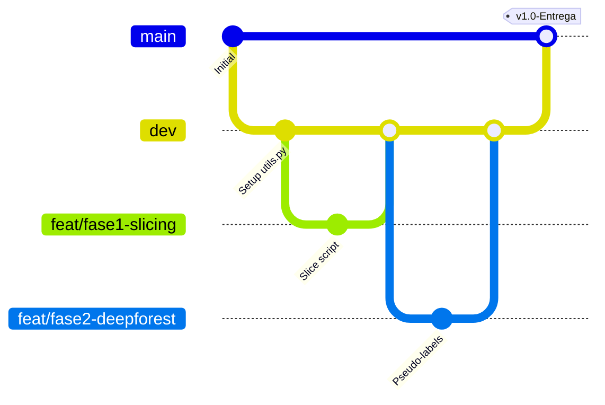

# Estratégia de Versionamento e Colaboração com Jupyter Notebooks

Trabalhar com arquivos Jupyter Notebook (`.ipynb`) em equipe no GitHub apresenta desafios sérios:
1. **Diferenças Caóticas (Git Diffs):** Como os notebooks são arquivos JSON gigantes, qualquer execução de célula altera metadados e contadores de execução, gerando milhares de linhas de diff no Git mesmo que nenhuma linha de código tenha mudado.
2. **Conflitos de Mesclagem (Merge Conflicts):** Resolver conflitos em blocos JSON de notebooks manualmente é quase impossível e frequentemente corrompe o arquivo.

Para mitigar esses problemas e garantir a integridade do código, o grupo adotará as seguintes práticas de engenharia de software:

---

## ⚠️ SEGURANÇA E POLÍTICA DE BACKUP DO GOOGLE DRIVE

O repositório do Google Drive para armazenamento dos dados pesados é:
🔗 [Google Drive - Pasta de Dados do Projeto](https://drive.google.com/drive/folders/11M2qj3BHYNDle173v8JT7gcz6kZtfLVY?usp=sharing)

> [!CAUTION]
> **ATENÇÃO MÁXIMA:** Como as imagens brutas (GeoTIFFs) e os datasets HDF5 são arquivos de múltiplos gigabytes, **não haverá backup local e nem backup no GitHub** (estes arquivos são pesados demais para Git). Todo integrante tem acesso total de edição nesta pasta. Um único arquivo apagado ou modificado incorretamente pode invalidar semanas de trabalho anterior.

### 🛡️ Regras de Sobrevivência para Manipulação de Arquivos:
1. **Bloqueio de Exclusão:** Sob nenhuma circunstância delete qualquer arquivo na pasta do Drive. Caso precise liberar espaço ou remover arquivos obsoletos, comunique todo o grupo em reunião antes de agir.
2. **Política de Versionamento Imutável (Append-Only):**
   - Nunca sobrescreva arquivos compartilhados existentes (como `dataset.h5`).
   - Se for gerar uma nova versão com melhorias (ex: anotações limpas pelo Núcleo 2), salve com uma nova nomenclatura incremental: `dataset_v1_raw.h5` -> `dataset_v2_QA_limpo.h5`.
   - Se precisar alterar um arquivo gerado por outro membro, faça uma cópia de segurança antes.
3. **Estrutura Organizacional Exclusiva:**
   - `/01_GeoTIFF_Original/` -> Pasta apenas de leitura. Ninguém altera após o download inicial feito pela Pessoa 1.
   - `/02_Datasets_HDF5/` -> Apenas arquivos compilados finalizados de cada fase (`dataset_v1.h5`, `dataset_v2.h5`).
   - `/03_Zips_Curadoria/` -> Arquivos compactados e relatórios de revisão gerados no Roboflow.
4. **Plano de Contingência (Recuperação de Desastres):**
   - Caso note a ausência de um arquivo crítico, verifique imediatamente a Lixeira da conta de Google Drive e faça a restauração.
   - O coordenador manterá um log simples de controle (ex: um arquivo de texto `LOG_DRIVE.txt` na raiz da pasta do Drive) anotando quem subiu o quê e quando.

---

## 📂 1. Modularização por Fase (Divisão de Notebooks)

Em vez de centralizar todo o trabalho em um único arquivo `main.ipynb` (o que causaria conflitos constantes), o repositório será dividido em **4 notebooks independentes**, mapeados pelas fases do projeto:

*   `01_data_pipeline.ipynb`: Coleta das ortofotos (GeoTIFF) do Geoportal do DF, fatiamento em 640x640, conversão para JPG e gravação inicial do arquivo HDF5 estruturado.
*   `02_pseudo_labelling.ipynb`: Execução do DeepForest sobre o arquivo HDF5, extração das predições de caixas delimitadoras e gravação das labels YOLO no HDF5.
*   `03_yolo_training.ipynb`: Carregamento do arquivo HDF5, extração das imagens/labels para a memória RAM (`/dev/shm` ou `/tmp`), configuração e treinamento do YOLOv11m.
*   `04_evaluation.ipynb`: Avaliação qualitativa e quantitativa dos modelos (DeepForest vs. YOLOv11m), plotagem de gráficos de desempenho (curvas PR, F1, matriz de confusão) e geração das imagens de inferência para o relatório.

### 🐍 Shared Code em `utils.py`
Funções reutilizáveis por mais de um notebook (ex: conversão de coordenadas, rotinas de I/O em HDF5, renderização de bounding boxes) serão salvas em um arquivo Python puro (`utils.py`). 
*   *Vantagem:* Alterações em funções compartilhadas são facilmente revisadas e versionadas pelo Git nativamente.

---

## 🧹 2. Limpeza Automatizada de Outputs com `nbstripout`

Para impedir que imagens de saída, logs de treino e números de execução poluam os commits, todos os integrantes deverão configurar o `nbstripout`. Ele funciona como um filtro do Git que limpa os outputs automaticamente **apenas no momento do commit** (mantendo os outputs visíveis no seu ambiente local enquanto você trabalha).

### Passo a Passo de Configuração (Windows):

1.  **Instalação do pacote:**
    No terminal da sua máquina (Command Prompt ou PowerShell), execute:
    ```bash
    pip install --upgrade nbstripout
    ```

2.  **Ativação do filtro no repositório local:**
    Navegue até a pasta do repositório Git do projeto e execute:
    ```bash
    nbstripout --install --unix-newlines
    ```
    *(A flag `--unix-newlines` força quebras de linha padrão Unix, prevenindo conflitos entre Windows e Linux).*

3.  **Verificação:**
    Para checar se o filtro está ativo, execute:
    ```bash
    nbstripout --status
    ```

---

## 🔀 3. Fluxo de Trabalho no Git (Git Flow do Projeto)

O repositório terá duas branches principais protegidas e branches auxiliares por funcionalidade:



1.  **Branch `main`:** Contém o código totalmente estável e testado, pronto para a entrega final da matéria. Nenhum integrante faz commits diretos na `main`.
2.  **Branch `dev`:** Branch de integração. Todos os desenvolvimentos de notebooks são integrados aqui.
3.  **Branches de Funcionalidade (`feat/...`):** Cada integrante cria uma branch específica para sua tarefa (ex: `feat/fase1-slicing`, `feat/fase3-yolo-training`).
    *   Sempre execute `Clear All Outputs` no notebook antes de fazer o commit se não tiver configurado o `nbstripout`.
    *   Ao finalizar, abra um **Pull Request (PR)** da sua branch para `dev`. Outro membro do grupo deve revisar as mudanças antes de aceitar o merge.

---

## 📦 4. Estratégia de I/O em HDF5 para Kaggle & Google Drive

Para viabilizar o uso de uma única conta do Kaggle e acelerar o treinamento, implementaremos o fluxo HDF5 + RAM Disk:

```
[ Google Drive (Único Link) ]
            │
            ▼ (Download rápido de arquivo único via gdown)
[ Kaggle /tmp ou /kaggle/working/dataset.h5 ]
            │
            ▼ (Extração em memória RAM via script Python: < 20 seg)
[ RAM Disk (/dev/shm) em estrutura YOLO ]
            │
            ▼ (Leitura a 3-6 GB/s)
[ Treinamento YOLOv11m na GPU ]
```

1.  **Armazenamento no Drive:** As imagens GeoTIFF originais e o arquivo compilado `dataset.h5` serão mantidos na conta de Google Drive do coordenador.
2.  **Download no Kaggle:** O notebook de treino baixa o `dataset.h5` diretamente do Drive usando `gdown` (muito mais rápido do que transferir milhares de imagens JPG).
3.  **Montagem do RAM Disk:** Antes de iniciar a chamada `yolo.train(...)`, o notebook executa um bloco que lê o HDF5 e extrai as imagens/labels diretamente para `/dev/shm/yolo_dataset` (RAM do contêiner) estruturado em pastas `images/` e `labels/`.
4.  **Treinamento Sem Gargalo:** O arquivo `data.yaml` aponta para `/dev/shm/yolo_dataset`. A GPU lê os dados da RAM com latência quase nula, maximizando o uso da placa e reduzindo o tempo de treino, de modo que o limite de 30h de GPU da conta única seja mais do que suficiente para o projeto inteiro.
